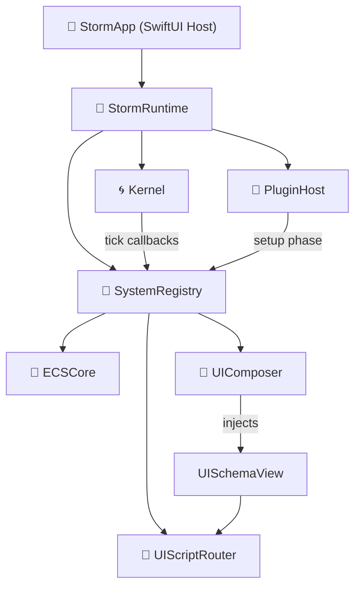
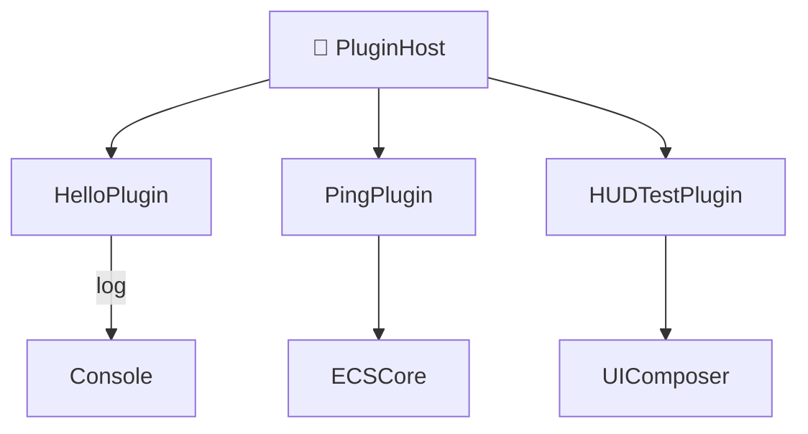

# 🌩️ Finalverse Storm — Architecture Overview

> Version: 0.1.0  
> Updated: July 9, 2025  
> Author: Finalverse Core Engineering

## 🧠 Runtime Layer

The Storm engine is orchestrated by a Swift-native `StormRuntime` (orchestrator) and a pure `Kernel` (tick engine). Together they support:

- Plugin-based modular loading
- ECS simulation ticks via Kernel callbacks
- UI schema injection and routing
- System service registration via `SystemRegistry`

### 🔷 High-Level Runtime Overview



### 🔷 Plugin Architecture (Current Plugins)



## 📦 Plugin Architecture

Each plugin conforms to the `StormPlugin` protocol and registers into the runtime with access to shared systems:

```
PluginHost → HelloPlugin, PingPlugin, HUDTestPlugin
          ↘︎ each plugin gets update(deltaTime:)
```

## 🧱 SystemRegistry

Central hub for service sharing and discovery:

| Key      | Service Type         |
|----------|----------------------|
| ecs      | ECSCore              |
| ui       | UIComposer           |
| router   | UIScriptRouter       |
| audio    | AudioEngine (planned)|
| llm      | LLMBroker (planned)  |

## 🧩 UISchema & UIComposer

- Dynamic HUDs are defined in JSON via `UISchema`
- Loaded by `UIComposer` at runtime
- Rendered recursively via `UISchemaView`
- Routed via `UIScriptRouter` to trigger commands (e.g., `echo.sing`)

## 🧠 ECSCore Engine

Lightweight ECS with:
- `EntityID → [Component]` store
- `ECSStepSystem` update interface
- Example: PingPlugin prints every 3 seconds

## 🦀 Rust FFI Layer

Rust logic is compiled into `libstorm.a` via staticlib and linked into Swift. Used for:

- Future ECS tick acceleration
- AI/LLM tokenization
- Procedural worldgen
- Audio synthesis

Targets:
- `aarch64-apple-darwin` for macOS
- `aarch64/x86_64-apple-ios` for iOS + simulator

## 📂 Folder Layout

```
storm/
├── App/           → SwiftUI entrypoint
├── Core/          → RuntimeKernel, SystemRegistry, Router
├── Engine/        → ECSCore and future systems
├── Plugins/       → HelloPlugin, PingPlugin, HUDTestPlugin
├── UI/            → ContentView, UISchemaView, UIComposer
├── RustCore/      → Rust logic (lib.rs, storm.h)
├── Libs/          → Precompiled libstorm.a per platform
└── docs/          → Documentation
```

## 🔜 Upcoming Modules

- EchoAgent.swift → memory, persona, prompt patching
- LLMBridge.swift → unified token streaming + function calling
- ProceduralWorld.swift → noise-based region layering
- AudioSongLayer.swift → dynamic audio themes

---

Finalverse Storm is built for AI-native simulation across devices.
