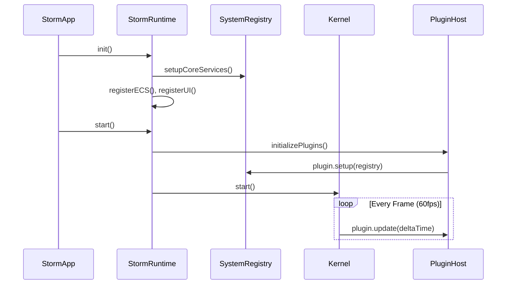
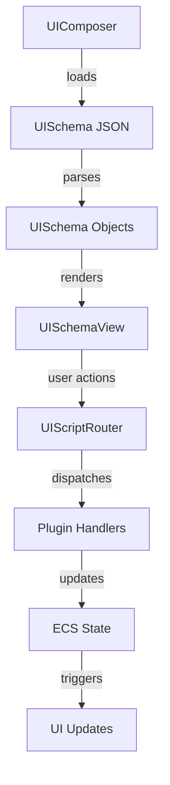
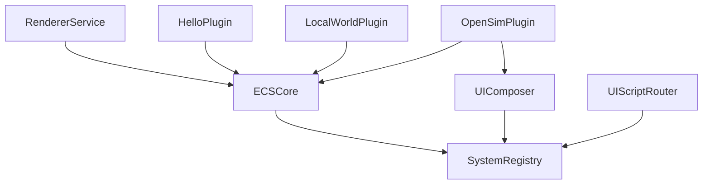

# 🏗️ Finalverse Storm - System Architecture Document

**File Path:** `storm/docs/SYSTEM_ARCHITECTURE.md`

**Description:** Detailed system architecture documentation covering high-level design patterns, component interactions, and architectural decisions for the Storm virtual world client.

## 🎯 Architecture Philosophy

Storm follows a **modular, event-driven, plugin-based architecture** designed for:
- **Cross-platform compatibility** (macOS, iOS, visionOS)
- **Real-time performance** with 60fps+ rendering
- **AI-native integration** with LLM and procedural systems
- **Extensibility** through dynamic plugin loading
- **Maintainability** via clean service separation

## 🧠 Core Architecture Layers

### **Layer 1: Application Host (SwiftUI)**
```swift
StormApp (SwiftUI @main)
├── WindowGroup lifecycle management
├── Environment object injection
└── Platform-specific scene configuration
```

**Responsibilities:**
- App lifecycle management (launch, background, termination)
- SwiftUI environment setup and dependency injection
- Platform-specific window/scene configuration
- Integration with iOS/macOS app frameworks

### **Layer 2: Runtime Orchestration**
```swift
StormRuntime (Orchestrator)
├── Kernel (Tick Engine)
├── SystemRegistry (Service Container)
├── PluginHost (Plugin Manager)
└── Service Coordination
```

**Responsibilities:**
- Coordinate startup/shutdown sequences
- Manage service dependencies and lifecycle
- Provide unified API for subsystem access
- Handle cross-cutting concerns (logging, metrics, health)

### **Layer 3: Core Services**
```swift
SystemRegistry
├── ECSCore (Entity Management)
├── UIComposer (Dynamic UI)
├── UIScriptRouter (Command Routing)
├── RendererService (3D Visualization)
└── [Future: AudioEngine, LLMBridge]
```

**Responsibilities:**
- Service registration and dependency injection
- Type-safe service resolution
- Service lifecycle management
- Cross-service communication facilitation

### **Layer 4: Engine Systems**
```swift
ECSCore
├── ECSWorld (Entity Storage)
├── Component Registry
├── System Execution Pipeline
└── Entity Lifecycle Management
```

**Responsibilities:**
- High-performance entity-component-system implementation
- Memory-efficient component storage
- System update ordering and dependencies
- Query optimization for large entity sets

### **Layer 5: Plugin Ecosystem**
```swift
PluginHost
├── HelloPlugin (Demo/Logging)
├── LocalWorldPlugin (Procedural World)
├── OpenSimPlugin (Virtual World Integration)
└── [Future: EchoAgent, AudioSong, ProceduralWorld]
```

**Responsibilities:**
- Modular feature implementation
- Hot-swappable functionality
- Domain-specific logic encapsulation
- Extension point for third-party features

## 🔄 Data Flow Architecture

### **Startup Sequence**


### **Service Communication Patterns**

#### **1. Direct Service Access**
```swift
// Plugin accesses ECS directly through registry
func setup(registry: SystemRegistry) {
    guard let ecs = registry.ecs else { return }
    let entity = ecs.getWorld().createEntity()
    // ... use ECS directly
}
```

#### **2. Event-Driven Communication**
```swift
// UI commands routed through UIScriptRouter
registry.router?.route(action: "echo.sing")
// Router dispatches to appropriate handler
```

#### **3. ECS System Updates**
```swift
// Systems process entities with specific components
func update(world: ECSWorld, deltaTime: TimeInterval) {
    let entities = world.entities(with: PositionComponent.self)
    for (id, position) in entities {
        // Update position logic
    }
}
```

## 🧩 Component Architecture

### **ECS Component Design**
```swift
// Component Pattern
protocol Component: AnyObject {}

// Concrete Components
class PositionComponent: Component {
    var position: SIMD3<Float>
}

class VelocityComponent: Component {
    var velocity: SIMD3<Float>
}

// System Pattern
class MovementSystem: ECSStepSystem {
    func update(world: ECSWorld, deltaTime: TimeInterval) {
        // Process entities with both Position and Velocity
    }
}
```

### **UI Schema Architecture**
```swift
// Dynamic UI Definition
struct UISchema {
    let type: String        // "button", "label", "panel"
    let label: String?
    let action: String?     // "echo.sing", "ui.reload"
    let children: [UISchema]?
}

// Rendering Pipeline
UIComposer → UISchema → UISchemaView → SwiftUI
```

### **Plugin Architecture**
```swift
// Plugin Interface
protocol StormPlugin {
    func setup(registry: SystemRegistry)    // One-time initialization
    func update(deltaTime: TimeInterval)    // Per-frame updates
}

// Plugin Registration
PluginHost.register(plugin) → Kernel.registerSystem(plugin.update)
```

## 🔌 FFI Integration Architecture

### **Rust-Swift Bridge Design**
```c
// C Header Bridge (storm.h)
typedef struct {
    float x, y, z;
    unsigned int mood;
} AgentSpec;

void storm_hello(void);
unsigned long storm_local_world_init(AgentSpec* specs, unsigned long max);
```

```rust
// Rust Implementation (lib.rs)
#[no_mangle]
pub extern "C" fn storm_hello() {
    println!("[🦀] Hello from Rust!");
}

#[repr(C)]
pub struct AgentSpec { /* ... */ }
```

```swift
// Swift Usage
import RustStorm
storm_hello()  // Calls Rust function
```

### **Performance-Critical Paths**
- **ECS tick acceleration** → Rust systems for high-entity-count scenarios
- **AI token processing** → Rust for LLM inference optimization
- **Procedural generation** → Rust for noise/terrain algorithms
- **Audio synthesis** → Rust for real-time audio processing

## 🎨 UI Architecture

### **Dynamic UI System**


### **Cross-Platform UI Strategy**
```swift
#if os(macOS)
    // macOS-specific controls (keyboard, mouse)
    MacOSInputHandler()
#else
    // iOS-specific controls (touch, gestures)
    VirtualJoystick()
    TouchGestures()
#endif
```

## 🔧 Service Registry Architecture

### **Type-Safe Service Resolution**
```swift
class SystemRegistry {
    private var services: [String: Any] = [:]
    
    func register<T>(_ service: T, for key: String) {
        services[key] = service
    }
    
    func resolve<T>(_ key: String) -> T? {
        return services[key] as? T
    }
}
```

### **Service Dependencies**


## 🚀 Performance Architecture

### **Real-Time Requirements**
- **Frame Rate**: Stable 60fps minimum, 120fps target
- **Memory**: Efficient component storage, minimal allocations
- **Latency**: <16.67ms frame time, <1ms input response
- **Scalability**: 1000+ entities with smooth performance

### **Optimization Strategies**

#### **ECS Optimizations**
```swift
// Component pool optimization
class ComponentPool<T: Component> {
    private var components: [T] = []
    private var freeIndices: [Int] = []
    
    func allocate() -> Int { /* reuse freed indices */ }
    func deallocate(_ index: Int) { /* return to pool */ }
}
```

#### **Update Loop Optimization**
```swift
// System dependency ordering
class SystemScheduler {
    func schedule(systems: [ECSStepSystem]) -> [ECSStepSystem] {
        // Topological sort based on component dependencies
        // Parallel execution where possible
    }
}
```

## 🔒 Error Handling Architecture

### **Defensive Programming Patterns**
```swift
// Safe service access
extension SystemRegistry {
    func safeECS() -> ECSCore? {
        guard let ecs = ecs else {
            print("[⚠️] ECS not available")
            return nil
        }
        return ecs
    }
}

// Plugin error isolation
func updatePlugin(_ plugin: StormPlugin, deltaTime: TimeInterval) {
    do {
        plugin.update(deltaTime: deltaTime)
    } catch {
        print("[❌] Plugin \(type(of: plugin)) failed: \(error)")
        // Continue with other plugins
    }
}
```

### **Health Monitoring**
```swift
// Service health tracking
struct ServiceHealth {
    let isHealthy: Bool
    let lastCheck: Date
    let issues: [String]
}

func checkSystemHealth() -> [String: ServiceHealth] {
    // Monitor ECS performance, memory usage, error rates
}
```

## 🔮 Future Architecture Extensions

### **Planned Components**
- **AudioSongLayer**: Dynamic audio theming system
- **LLMBridge**: Unified AI integration with function calling
- **ProceduralWorld**: Noise-based terrain and world generation
- **EchoAgent**: AI personality and memory management
- **NetworkBridge**: Multi-user synchronization
- **AssetStreaming**: Dynamic content loading

### **Scalability Considerations**
- **Horizontal Scaling**: Multi-threaded ECS systems
- **Memory Management**: Component streaming for large worlds
- **Network Architecture**: Client-server synchronization
- **Platform Expansion**: Android, Windows, WebAssembly targets

---

This architecture provides a solid foundation for a production-ready virtual world client while maintaining flexibility for future enhancements and platform expansions.
